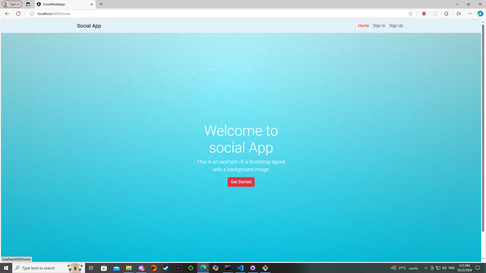

# SocialMediaApp

This project was generated with [Angular CLI](https://github.com/angular/angular-cli) version 16.2.16.

## Development server

Run `ng serve` for a dev server. Navigate to `http://localhost:4200/`. The application will automatically reload if you change any of the source files.

## Code scaffolding

Run `ng generate component component-name` to generate a new component. You can also use `ng generate directive|pipe|service|class|guard|interface|enum|module`.

## Build

Run `ng build` to build the project. The build artifacts will be stored in the `dist/` directory.

## Running unit tests

Run `ng test` to execute the unit tests via [Karma](https://karma-runner.github.io).

## Running end-to-end tests

Run `ng e2e` to execute the end-to-end tests via a platform of your choice. To use this command, you need to first add a package that implements end-to-end testing capabilities.

## Further help

To get more help on the Angular CLI use `ng help` or go check out the [Angular CLI Overview and Command Reference](https://angular.io/cli) page.

imagine a social media app designed with a sleek, user-friendly interface that not only lets you create and share posts but also allows you to react and comment on others’ content. This app saves user data locally, ensuring quick access and privacy. Users can seamlessly scroll through their feed, engage with friends' updates through likes, loves, and comments, and even start lively discussions. Whether sharing your latest adventure or sparking a conversation, this app fosters a vibrant, interactive community. It’s more than just a social network—it’s your personal hub for connection and engagement, all stored securely on your local device.

## Stunning landing page

